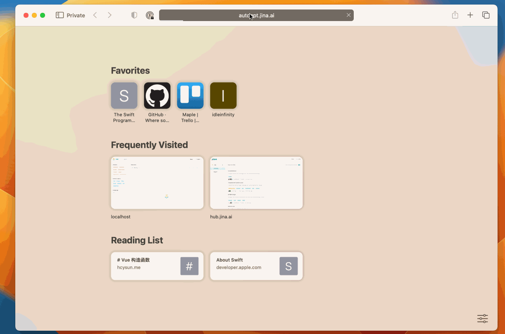

# AutoGPT Website

**Set Your Goals, AI Achieves Them.** You can set up the initial role and goals for your AI buddy, without human's supervision, it will automatically leverage all of the resources it has to achieve your goal.

Inspired by [Auto-GPT](https://github.com/Torantulino/Auto-GPT).

## Features

- 🌐 Internet access for searches and information gathering
- 💾 Save your definition of AI, chat history and credentials in the browser
- [ ] Long-Term memory (based on browser-based vector database)
- [ ] Electron Application
- [ ] Using Electron webview to conduct search operations (remove google search api limitation and solve SPA problem)
- [ ] Calculate tokens and evaluate cost

## Requirements

Required:

- OpenAI API Key
- Google
  - Search API Key
  - Custom Search Engine ID

## Security

- All of your credentials will be saved in your local browser **ONLY** and be sent to the providers (OpenAI, Google Search API...) when necessary. You can remove them completely anytime.
- All of your chat history will be saved in your local browser **ONLY**. You can remove them completely anytime.

## [Development](./CONTRIBUTING.md)
